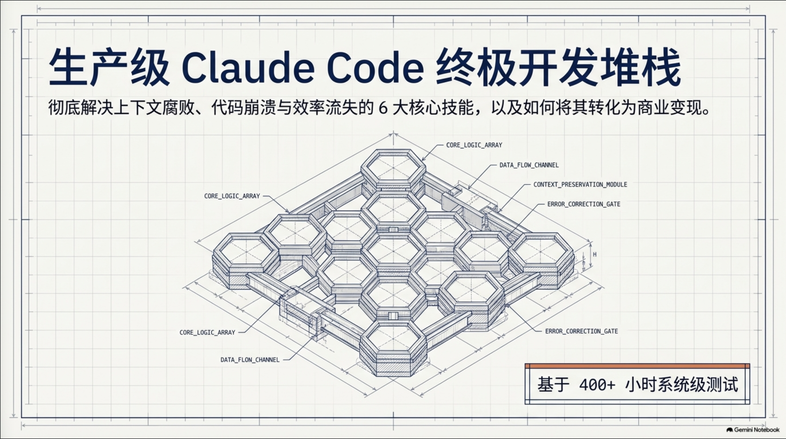
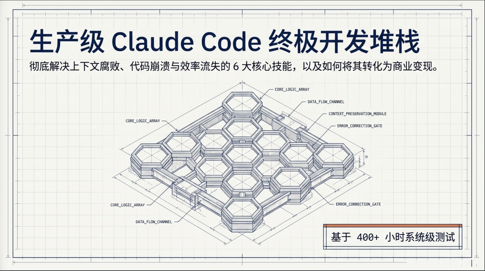

# nlm-unwatermark


[](https://github.com/encoreshao/nlm-unwatermark/stargazers)
[](https://github.com/encoreshao/nlm-unwatermark/issues)

[English](README.md) | [中文](README_zh.md) | [Français](README_fr.md) | [日本語](README_ja.md)

PDF・PPTX・画像（PNG/JPG/WEBP）の書き出しから「NotebookLM」の透かしを除去します。単色の塗りつぶしではなくコンピュータビジョンによるインペインティングを使うため、グラデーション、テクスチャ、スライドの枠線がそのまま保たれます。

## Before / After

| Before | After |
| --- | --- |
|  |  |

## 目次

- [Before / After](#before--after)
- [仕組み](#仕組み)
- [必要環境](#必要環境)
- [インストール](#インストール)
- [使い方](#使い方)
  - [オプション](#オプション)
- [スタンドアロン実行ファイル](#スタンドアロン実行ファイル)
- [プロジェクト構成](#プロジェクト構成)
- [開発](#開発)
- [コントリビューション](#コントリビューション)
- [法的事項とフェアユース](#法的事項とフェアユース)
- [ライセンス](#ライセンス)

## 仕組み

1. **検出** — コントラスト解析とテキストのテンプレートマッチングにより、近くのスライド内容を除外しながら透かしの位置を特定します。
2. **再構築** — 透かしの背後にある背景を、同じページ内の近傍のきれいな領域から復元します（きれいな領域が見つからない場合はインペインティングにフォールバックします）。
3. **パッチ適用** — PDF ではテキストレイヤーから透かしのテキストを直接削除し（上に重ねるのではなくレダクション）、アイコン部分のみ小規模なラスター修正を行います。PPTX と画像はレンダリング後のピクセルに直接パッチを適用します。

## 必要環境

- Python 3.9 以上
- pip
- 依存パッケージ（自動インストールされます）：[PyMuPDF](https://pypi.org/project/PyMuPDF/)、[Pillow](https://pypi.org/project/Pillow/)、[opencv-python-headless](https://pypi.org/project/opencv-python-headless/)、[NumPy](https://pypi.org/project/numpy/)、[tqdm](https://pypi.org/project/tqdm/)

## インストール

```bash
git clone https://github.com/encoreshao/nlm-unwatermark.git
cd nlm-unwatermark
python3 -m venv venv && source venv/bin/activate   # Windows: venv\Scripts\activate
pip install -r requirements.txt
pip install -e .           # 任意 —— `nlm-unwatermark` コマンドが使えるようになります
```

インストールを確認します。

```bash
nlm-unwatermark --help
```

使用方法が表示されれば準備完了です。

## 使い方

```bash
nlm-unwatermark file.pdf                # → file_cleaned.pdf
nlm-unwatermark file.pptx                # → file_cleaned.pptx
nlm-unwatermark slide.png                # → slide_cleaned.png
nlm-unwatermark ./my_folder/             # フォルダ内の対応ファイルを一括処理
nlm-unwatermark file.pdf --preview       # PDFのみ：先頭ページだけ処理
nlm-unwatermark file.pdf -o out.pdf      # 出力パスを指定
```

`pip install -e .` を実行していない場合は、代わりに `python -m nlm_unwatermark file.pdf` を使用してください。動作は同じです。

### オプション

| フラグ | デフォルト値 | 説明 |
|---|---|---|
| `-o`, `--output` | `<ファイル名>_cleaned.<拡張子>` | 出力パス（単一ファイル処理時のみ有効） |
| `--preview` | オフ | PDFのみ — 先頭ページだけ処理 |
| `--margin-x` | `400` | 右端からの検索幅（px） |
| `--margin-y` | `120` | 下端からの検索高さ（px） |
| `--threshold` | `22` | 候補ピクセルのコントラスト閾値 |
| `--text-threshold` | `0.33` | テキストと判定するために必要なテンプレートマッチングの信頼度 |
| `--scale` | `3.5` | PDFレンダリング／画像の拡大倍率 |
| `--radius` | `3` | インペインティング半径（フォールバック時のみ使用） |
| `--no-patch-heal` | オフ | きれいな領域による修復ではなく、通常のインペインティングを使用 |
| `--debug` | オフ | 検出したマスクを `debug_watermark/` に出力 |

## スタンドアロン実行ファイル

Python環境を用意したくない場合は、Windows・macOS・Linux向けにインタプリタや依存関係が不要な単一ファイルの実行ファイルをビルドできます。詳しくは下記の[開発](#開発)を参照してください。

```bash
# Windows
dist\nlm-unwatermark.exe file.pdf

# macOS / Linux
dist/nlm-unwatermark file.pdf
```

## プロジェクト構成

```
nlm_unwatermark/
├── cli.py              CLIエントリポイント（nlm-unwatermark / python -m nlm_unwatermark）
├── config.py            検出・除去の調整可能なパラメータ
├── detection.py          透かしの位置特定（候補抽出 + テンプレートマッチング）
├── reconstruction.py      背景の修復・インペインティング
├── engine.py              検出と再構築をつなぐ処理
└── formats/               フォーマット別処理：pdf.py、image.py、pptx.py
packaging/
├── entry_point.py         PyInstaller向けの絶対インポート対応エントリポイント
└── nlm-unwatermark.spec   PyInstallerビルド仕様
docs/
└── BUILD.md               スタンドアロン実行ファイルのビルド手順
```

## 開発

[インストール](#インストール)と同様の手順でローカル開発環境を構築してください —— **必ずその仮想環境の中で**作業し、グローバル/共有の Python インタプリタは使わないでください。実行ファイルをパッケージングする予定がある場合はビルド専用の依存関係もインストールします。

```bash
python3 -m venv venv && source venv/bin/activate   # Windows: venv\Scripts\activate
pip install -r requirements.txt -r requirements-build.txt
python -m PyInstaller packaging/nlm-unwatermark.spec --noconfirm
```

> **独立した venv が必要な理由:** PyInstaller は、オプションかつ未使用のコードパスからしか到達しない import（例: PyMuPDF の `Table.to_pandas()`）も含め、見つかったすべての import を静的に追跡します。pandas や torch など本プロジェクトと無関係な重量級パッケージがインストールされた共有/グローバルなインタプリタでビルドすると、それらも取り込まれてしまい、ビルドが失敗することがあります —— `numpy.dtype size changed` のようなエラーは、プロジェクト外から互換性のない `pandas`/`numpy` の組み合わせが紛れ込んだサインです。`requirements.txt` と `requirements-build.txt` だけをインストールしたクリーンな venv を使えば、この問題は完全に回避できます。

`nlm_unwatermark/__main__.py` ではなく `packaging/entry_point.py` をビルド仕様のターゲットにしている理由など、ビルドの詳細は [docs/BUILD.md](docs/BUILD.md) を参照してください。

検出・除去の挙動（マージン、閾値、インペインティング半径など）の調整項目は `nlm_unwatermark/config.py` にあり、`nlm_unwatermark/cli.py` でCLIオプションとして公開されています —— 上記の[オプション](#オプション)表を参照してください。

## コントリビューション

プルリクエストを歓迎します —— 大きな変更を行う前に[Issueを立てて](https://github.com/encoreshao/nlm-unwatermark/issues/new)ご相談ください。

## 法的事項とフェアユース

本ツールは、自身が所有する、または改変する権利を持つドキュメントにのみ使用してください —— 使用方法については利用者自身の責任となります。生成されたコンテンツの所有権が自分にある場合、透かしの除去は正当な行為です（Googleは NotebookLM の生成物について所有権を主張しないとしています）。本ツールは、自身が書き出したコンテンツを整理するためのものです。MITライセンスのもとで提供されていますが、有料サービスの帰属表示や課金要件を回避する目的での使用は推奨されません。

## ライセンス

MIT © 2026 [Encore Shao](LICENSE)
